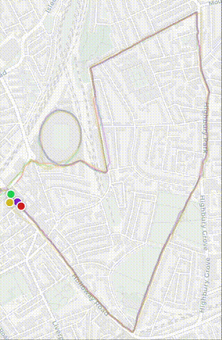

# Track Comparison

A web application that allows you to upload and compare multiple GPX tracks on an interactive map. Perfect for comparing your Strava runs against each other!

## Running locally

1. Install dependencies:
```bash
npm install
```

2. Start the development server:
```bash
npm start
```

3. Open [http://localhost:3000](http://localhost:3000) to view it in your browser.

## Usage

1. Click the "Choose File" button in the top bar
2. Select one or more GPX files from your computer
3. Each track will be displayed on the map with a unique color
4. Use the time slider to animate the tracks and compare positions
5. Toggle the "Smooth tracks" option to reduce GPS noise

## Exporting GPX from Strava

1. Go to your activity on Strava
2. Click the three dots menu (⋮) in the top right
3. Select "Export GPX"
4. The GPX file will be downloaded to your computer
5. Upload the file to this application to visualize it 